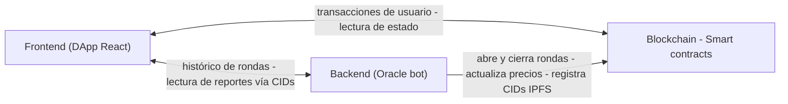

```mermaid
flowchart LR
    F["Frontend (DApp React)"] <-->|transacciones de usuario - lectura de estado| BC["Blockchain - Smart contracts"]

    B["Backend (Oracle bot)"] -->|abre y cierra rondas - actualiza precios - registra CIDs IPFS| BC

    F <-->|histórico de rondas - lectura de reportes vía CIDs| B
```
