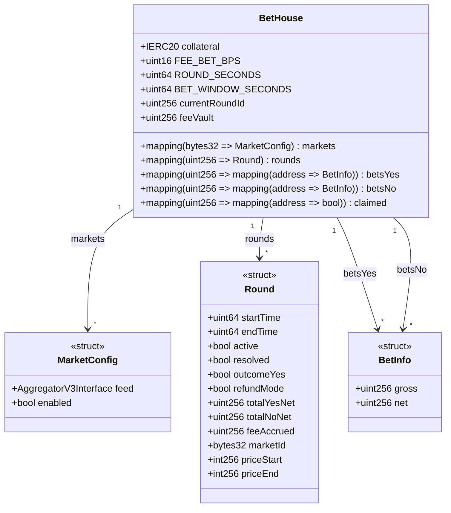

```mermaid
classDiagram
    class BetHouse {
        +IERC20 collateral
        +uint16 FEE_BET_BPS
        +uint64 ROUND_SECONDS
        +uint64 BET_WINDOW_SECONDS

        +uint256 currentRoundId
        +uint256 feeVault

        +mapping(bytes32 => MarketConfig) markets
        +mapping(uint256 => Round) rounds
        +mapping(uint256 => mapping(address => BetInfo)) betsYes
        +mapping(uint256 => mapping(address => BetInfo)) betsNo
        +mapping(uint256 => mapping(address => bool)) claimed
    }

    class MarketConfig {
        <<struct>>
        +AggregatorV3Interface feed
        +bool enabled
    }

    class Round {
        <<struct>>
        +uint64 startTime
        +uint64 endTime
        +bool active
        +bool resolved
        +bool outcomeYes
        +bool refundMode
        +uint256 totalYesNet
        +uint256 totalNoNet
        +uint256 feeAccrued
        +bytes32 marketId
        +int256 priceStart
        +int256 priceEnd
    }

    class BetInfo {
        <<struct>>
        +uint256 gross
        +uint256 net
    }

    %% Relaciones de datos
    BetHouse "1" --> "*" MarketConfig : markets
    BetHouse "1" --> "*" Round : rounds
    BetHouse "1" --> "*" BetInfo : betsYes
    BetHouse "1" --> "*" BetInfo : betsNo

```
