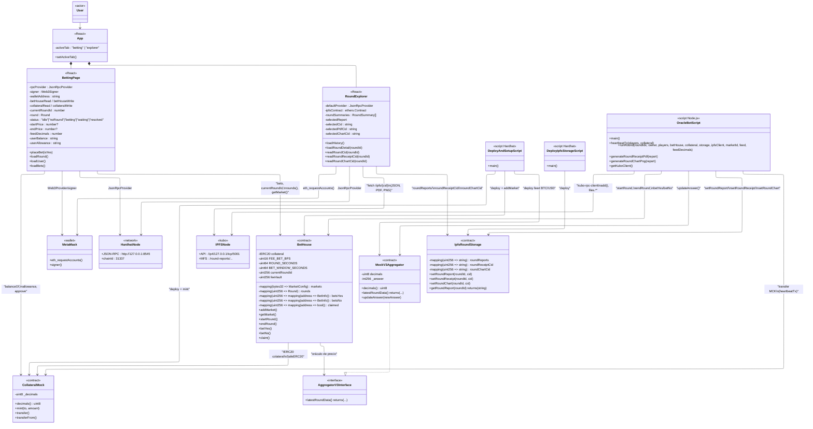

```mermaid
---
config:
  layout: elk
---
classDiagram
    class User {
      <<actor>>
    }

    class MetaMask {
      <<wallet>>
      +eth_requestAccounts()
      +signer()
    }

    class HardhatNode {
      <<network>>
      +JSON-RPC : http://127.0.0.1:8545
      +chainId : 31337
    }

    class IPFSNode {
      <<kubo>>
      +API : /ip4/127.0.0.1/tcp/5001
      +MFS : /round-reports/...
    }
    class App {
      <<React>>
      -activeTab : "betting" | "explorer"
      +setActiveTab()
    }

    class BettingPage {
      <<React>>
      -rpcProvider : JsonRpcProvider
      -signer : Web3Signer
      -walletAddress : string
      -betHouseRead / betHouseWrite
      -collateralRead / collateralWrite
      -currentRoundId : number
      -round : Round
      -status : "idle"|"noRound"|"betting"|"waiting"|"resolved"
      -startPrice : number?
      -endPrice : number?
      -feedDecimals : number
      -userBalance : string
      -userAllowance : string
      +placeBet(isYes)
      +loadRound()
      +loadUser()
      +loadBets()
    }

    class RoundExplorer {
      <<React>>
      -defaultProvider : JsonRpcProvider
      -ipfsContract : ethers.Contract
      -roundSummaries : RoundSummary[]
      -selectedReport
      -selectedCid : string
      -selectedPdfCid : string
      -selectedChartCid : string
      +loadHistory()
      +loadRoundDetail(roundId)
      +readRoundCid(roundId)
      +readRoundReceiptCid(roundId)
      +readRoundChartCid(roundId)
    }

    class BetHouse {
      <<contract>>
      -IERC20 collateral
      -uint16 FEE_BET_BPS
      -uint64 ROUND_SECONDS
      -uint64 BET_WINDOW_SECONDS
      -uint256 currentRoundId
      -uint256 feeVault
      -mapping(bytes32 => MarketConfig) markets
      -mapping(uint256 => Round) rounds
      -mapping(uint256 => mapping(address => BetInfo)) betsYes
      -mapping(uint256 => mapping(address => BetInfo)) betsNo
      -mapping(uint256 => mapping(address => bool)) claimed
      +addMarket()
      +getMarket()
      +startRound()
      +endRound()
      +betYes()
      +betNo()
      +claim()
    }

    class CollateralMock {
      <<contract>>
      -uint8 _decimals
      +decimals() uint8
      +mint(to, amount)
      +transfer()
      +transferFrom()
    }

    class AggregatorV3Interface {
      <<interface>>
      +latestRoundData() returns(...)
    }

    class MockV3Aggregator {
      <<contract>>
      -uint8 decimals
      -int256 _answer
      +decimals() uint8
      +latestRoundData() returns(...)
      +updateAnswer(newAnswer)
    }

    class IpfsRoundStorage {
      <<contract>>
      -mapping(uint256 => string) roundReports
      -mapping(uint256 => string) roundReceiptCid
      -mapping(uint256 => string) roundChartCid
      +setRoundReport(roundId, cid)
      +setRoundReceipt(roundId, cid)
      +setRoundChart(roundId, cid)
      +getRoundReport(roundId) returns(string)
    }
    class DeployAndSetupScript {
      <<script Hardhat>>
      +main()
    }

    class DeployIpfsStorageScript {
      <<script Hardhat>>
      +main()
    }

    class OracleBotScript {
      <<script Node.js>>
      +main()
      +heartbeatTx(players, collateral)
      +runRound(roundIdx, owner, players, betHouse, collateral, storage, ipfsClient, marketId, feed, feedDecimals)
      +generateRoundReceiptPdf(report)
      +generateRoundChartPng(report)
      +getKuboClient()
    }
    User --> App
    App *-- BettingPage
    App *-- RoundExplorer

    BettingPage --> MetaMask : Web3Provider/signer
    RoundExplorer --> MetaMask : eth_requestAccounts()

    BettingPage --> HardhatNode : JsonRpcProvider
    RoundExplorer --> HardhatNode : JsonRpcProvider
    BettingPage --> BetHouse : "bets, currentRoundId,\nrounds(), getMarket()"
    BettingPage --> CollateralMock : "balanceOf,\nallowance, approve"

    RoundExplorer --> IpfsRoundStorage : "roundReports/\nroundReceiptCid/\nroundChartCid"
    BetHouse --> CollateralMock : "IERC20 colateral\nSafeERC20"
    BetHouse --> AggregatorV3Interface : "oráculo de precio"

    MockV3Aggregator ..|> AggregatorV3Interface

    OracleBotScript --> BetHouse : "startRound,\nendRound,\nbetYes/betNo"
    OracleBotScript --> MockV3Aggregator : "updateAnswer()"
    OracleBotScript --> CollateralMock : "transfer MCK\n(heartbeatTx)"
    OracleBotScript --> IpfsRoundStorage : "setRoundReport/\nsetRoundReceipt/\nsetRoundChart"
    OracleBotScript --> IPFSNode : "kubo-rpc-client\nadd(), files.*"

    RoundExplorer --> IPFSNode : "fetch /ipfs/{cid}\n(JSON, PDF, PNG)"

    DeployAndSetupScript --> CollateralMock : "deploy + mint"
    DeployAndSetupScript --> MockV3Aggregator : "deploy feed BTC/USD"
    DeployAndSetupScript --> BetHouse : "deploy + addMarket"
    DeployIpfsStorageScript --> IpfsRoundStorage : "deploy"
```
