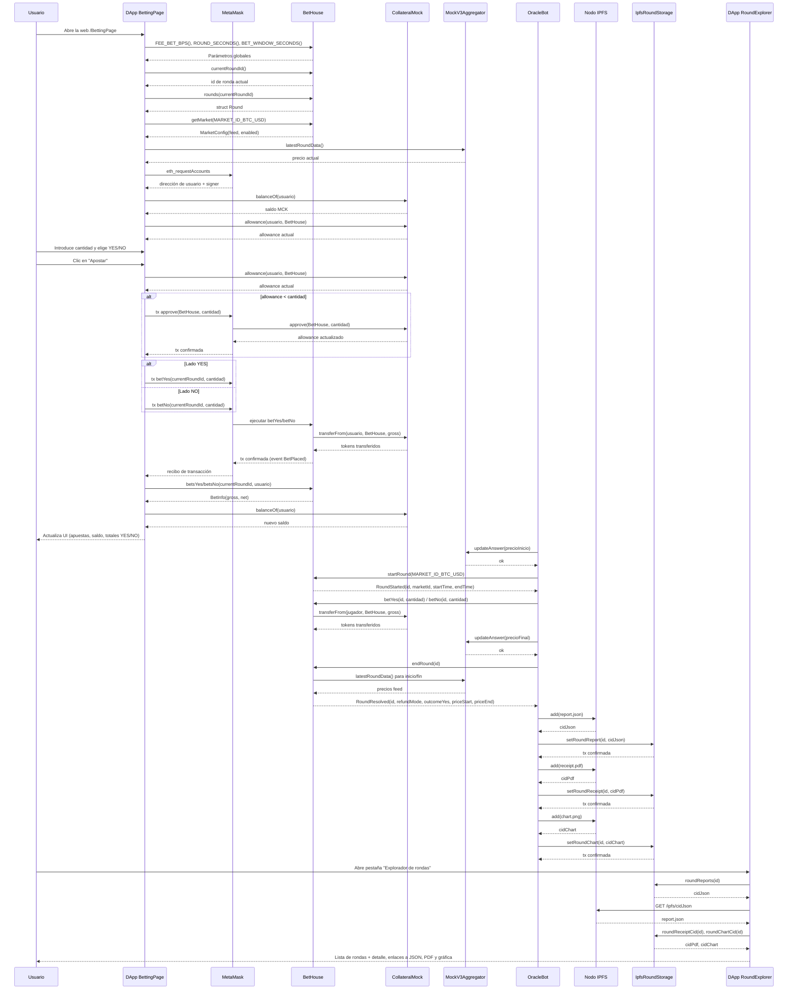

``` mermaid
sequenceDiagram
    participant U as Usuario
    participant B as DApp BettingPage
    participant MM as MetaMask
    participant BH as BetHouse
    participant COL as CollateralMock
    participant FEED as MockV3Aggregator
    participant OB as OracleBot
    participant IPFS as Nodo IPFS
    participant ST as IpfsRoundStorage
    participant EX as DApp RoundExplorer

    %% Inicialización de la DApp
    U->>B: Abre la web /BettingPage
    B->>BH: FEE_BET_BPS(), ROUND_SECONDS(), BET_WINDOW_SECONDS()
    BH-->>B: Parámetros globales
    B->>BH: currentRoundId()
    BH-->>B: id de ronda actual
    B->>BH: rounds(currentRoundId)
    BH-->>B: struct Round
    B->>BH: getMarket(MARKET_ID_BTC_USD)
    BH-->>B: MarketConfig(feed, enabled)
    B->>FEED: latestRoundData()
    FEED-->>B: precio actual

    %% Conexión de cartera
    B->>MM: eth_requestAccounts
    MM-->>B: dirección de usuario + signer
    B->>COL: balanceOf(usuario)
    COL-->>B: saldo MCK
    B->>COL: allowance(usuario, BetHouse)
    COL-->>B: allowance actual

    %% Apuesta del usuario
    U->>B: Introduce cantidad y elige YES/NO
    U->>B: Clic en "Apostar"
    B->>COL: allowance(usuario, BetHouse)
    COL-->>B: allowance actual
    alt allowance < cantidad
        B->>MM: tx approve(BetHouse, cantidad)
        MM->>COL: approve(BetHouse, cantidad)
        COL-->>MM: allowance actualizado
        MM-->>B: tx confirmada
    end
    alt Lado YES
        B->>MM: tx betYes(currentRoundId, cantidad)
    else Lado NO
        B->>MM: tx betNo(currentRoundId, cantidad)
    end
    MM->>BH: ejecutar betYes/betNo
    BH->>COL: transferFrom(usuario, BetHouse, gross)
    COL-->>BH: tokens transferidos
    BH-->>MM: tx confirmada (event BetPlaced)
    MM-->>B: recibo de transacción
    B->>BH: betsYes/betsNo(currentRoundId, usuario)
    BH-->>B: BetInfo(gross, net)
    B->>COL: balanceOf(usuario)
    COL-->>B: nuevo saldo
    B-->>U: Actualiza UI (apuestas, saldo, totales YES/NO)

    %% Ciclo de ronda orquestado por OracleBot
    OB->>FEED: updateAnswer(precioInicio)
    FEED-->>OB: ok
    OB->>BH: startRound(MARKET_ID_BTC_USD)
    BH-->>OB: RoundStarted(id, marketId, startTime, endTime)

    %% (Opcional) bots/jugadores también llaman betYes/betNo
    OB->>BH: betYes(id, cantidad) / betNo(id, cantidad)
    BH->>COL: transferFrom(jugador, BetHouse, gross)
    COL-->>BH: tokens transferidos

    %% Cierre y resolución de ronda
    OB->>FEED: updateAnswer(precioFinal)
    FEED-->>OB: ok
    OB->>BH: endRound(id)
    BH->>FEED: latestRoundData() para inicio/fin
    FEED-->>BH: precios feed
    BH-->>OB: RoundResolved(id, refundMode, outcomeYes, priceStart, priceEnd)

    %% Generación de reportes y subida a IPFS
    OB->>IPFS: add(report.json)
    IPFS-->>OB: cidJson
    OB->>ST: setRoundReport(id, cidJson)
    ST-->>OB: tx confirmada

    OB->>IPFS: add(receipt.pdf)
    IPFS-->>OB: cidPdf
    OB->>ST: setRoundReceipt(id, cidPdf)
    ST-->>OB: tx confirmada

    OB->>IPFS: add(chart.png)
    IPFS-->>OB: cidChart
    OB->>ST: setRoundChart(id, cidChart)
    ST-->>OB: tx confirmada

    %% Consulta histórica en RoundExplorer
    U->>EX: Abre pestaña "Explorador de rondas"
    EX->>ST: roundReports(id)
    ST-->>EX: cidJson
    EX->>IPFS: GET /ipfs/cidJson
    IPFS-->>EX: report.json

    EX->>ST: roundReceiptCid(id), roundChartCid(id)
    ST-->>EX: cidPdf, cidChart

    EX-->>U: Lista de rondas + detalle, enlaces a JSON, PDF y gráfica

```
